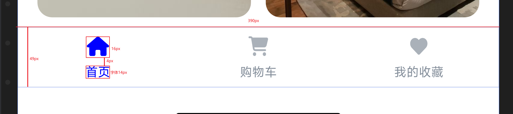

鱼头笔记

项目架构
==================   服务监控   ===================

####  SkyWalking


#### ElaticSearch  、Logstash 、Kibana


####  node export


```text

====================================================
调研

立项 启动

需求分析
需规编写

图：业务架构、技术架构、数据交互架构、部署架构


详细设计
UI 页面设计


=====================================================
环境搭建
编写代码


=====================================================
测试
上线


```


## 项目架构
```text

1.超级管理员

2.企业管理

3.app管理端

4.用户端


规则
1.所有的实运营的都在app端: 公众号、小程序、微信支付、支付宝支付
2.路由划分
    /tx/业务/                    超级管理员
    /admin/企业Code/业务/         企业管理
    /appAdmin/appID/业务/        app管理端
    /app/appID/业务/             用户端
3.页面命名
    企业-app名-页面名           ent_shopping_user            企业
    app管理-app名-页面名        appAdmin_shopping_user       app管理端
    app-app名-页面名           app_shopping_user            用户端
    

4.项目命名
    admin                    超级管理员
    admin_enterprise         企业管理
    app名_admin               app管理端
    app名_app                 app用户端
    app名_guide               app导购端( 分销 )


5.版权问题
    字体、图片、音乐、视频


```

## UI 设计规范

```text
物理像素         像素密度PPI         逻辑像素
px                                 pt


375pt   390pt


1.配色数值
    全局品牌色:
    品牌过渡色:
    卡片背景色
    重点强调
    辅助色
       
2.字体字号
3.图标样式
4.图标风格
5.弹窗、提示框
6.按钮样式
7.表单分页
8.图片尺寸
9.布局
    栅格系统
        边距:
        内容相对宽度:
        列:
        水槽:
        


一个产品一个东西的主题是什么？想表达什么意思？


```


## tabBar 示例

```text
一倍图390 组件标准
    tabBar
        高: 49px
        有icon
            icon: 盒子20x20  icon高:16px 宽:自适应
            字: 14px 不多于4个字 margin-top:4px
        无icon
            字: 16px
```


