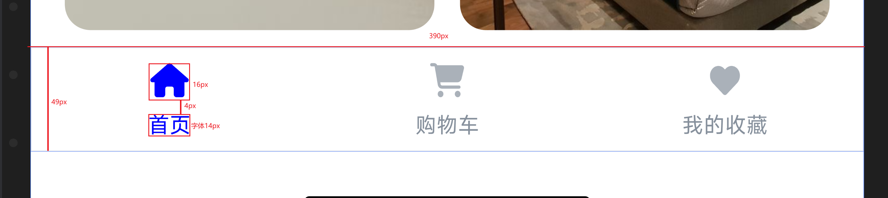

## tabBar 示例

```text
一倍图390 组件标准
    tabBar
        高: 49px
        有icon
            icon: 盒子20x20  icon高:16px 宽:自适应
            字: 14px 不多于4个字 margin-top:4px
        无icon
            字: 16px
```


