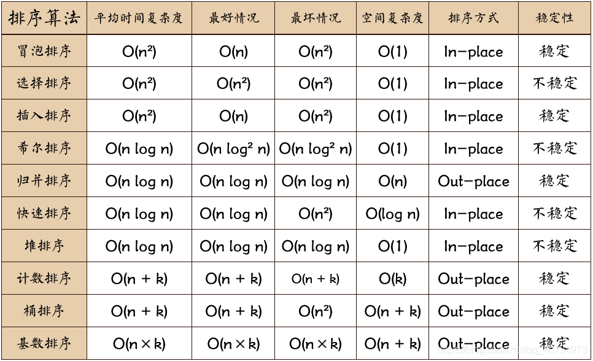
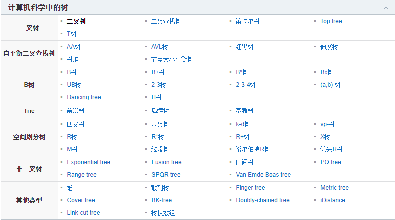

#### 1.冒泡排序


```java
public static void main(String[] args) {
    int[] arr = {1, 23, 4, 5, 88, 9, 6, 4, 7, 8, 2, 43, 54, 40};
    for (int i = 0; i < arr.length; i++) {
        for (int j = i + 1; j < arr.length; j++) {
            if (arr[i] > arr[j]) {
                int m = arr[i];
                arr[i] = arr[j];
                arr[j] = m;
            }
        }
    }
    for (int i = 0; i < arr.length; i++) {
        System.out.print(arr[i] + "\t");
    }
}
```

#### 2.选择排序


```java
public static void main(String[] args) {
    int[] arr = {1, 23, 4, 5, 88, 9, 6, 4, 7, 8, 2, 43, 54, 40};
    for (int i = 0; i < arr.length; i++) {
        int minIndex = i;
        for (int j = i + 1; j < arr.length; j++) {
            if (arr[j] - arr[minIndex] < 0) {
                minIndex = j;
            }
        }
        if (minIndex != i) {
            int temp = arr[i];
            arr[i] = arr[minIndex];
            arr[minIndex] = temp;
        }
    }
    for (int i = 0; i < arr.length; i++) {
        System.out.print(arr[i] + "\t");
    }
}
```

#### 3.插入排序


```java
public static void main(String[] args) {
    int[] arr = {1, 23, 4, 5, 88, 9, 6, 4, 7, 8, 2, 43, 54, 40};
    int n = arr.length;
    for (int i = 0; i < n; i++) {
        int e = arr[i];
        int j = i;
        for (; j > 0 && (arr[j - 1] - e > 0); j--) {
            arr[j] = arr[j - 1];
        }
        arr[j] = e;
    }
    for (int i = 0; i < arr.length; i++) {
        System.out.print(arr[i] + "\t");
    }
}
```

#### 4.希尔排序


#### 5.归并排序


#### 6.快速排序


#### 7.堆排序


#### 8.


# 查找算法

#### 1.顺序查找

#### 2.二分查找

#### 3.插值查找

#### 4.斐波那契查找

#### 5.树表查找

#### 6.分块查找

#### 7.哈希查找


# 树



### 二叉树

#### 满二叉树

#### 完全二叉树

