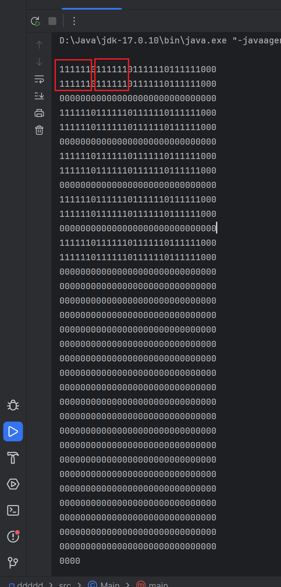

### 显示屏必须知道的值
宽度：
高度：


### 丝滑移动位置
```C
/*
丝滑移动位置
a 当前值
a_trg 期待值
b 速度
*/
void ui_run(int* a, int* a_trg, int b){
	if(*a < *a_trg){ // 当前小于期待
		*a+=b;				 // 当前加一小步(b)
		if(*a > *a_trg){// 如果当前值大于期待值则等于期待值
			*a = *a_trg;
		}
	} else if(*a > *a_trg){ // 与第一步类似
		*a-=b;
		if(*a < *a_trg){
			*a = *a_trg;
		}
	} else {
		*a = *a_trg;
	}
}
```

### 菜单


第一步:初始化计算中心点 x, y  <br>
第二步:添加icon的时候的确实icon的顺序   <br>
第三步:确定光标位置    <br>
第四步:确定每一个icon相对显示的位置 <br>
第五点:缩放icon   <br>

### 在地图上放文字

```java
public static void main(String[] args) {
    // 一个大地图
    int map[] = new int[1024];
    Arrays.fill(map, 0);
    // 地图宽度
    int mapWidth = 30;
    // 地图上有一个Logo;
    int logoData[] = new int[12];
    Arrays.fill(logoData, 1);
    // logo 宽为2  高为    logoData/宽
    int logoWidth = 6;

    // 放二十个logo, 超过则换行, 光标从（0,0）开始
    int x = 0;
    int y = 0;
    int num = 20;
    while (num > 0) {
        num--;
        if ((x + logoWidth) > mapWidth) {
            // 判断是否要换行
            y += (logoData.length / logoWidth) + 1;
            x = 0;
        }
        // 将 logo 放置 地图 x,y 坐标上
        int tempX = x;
        int tempY = y;
        for (int i = 0; i < logoData.length; i += logoWidth) {
            for (int j = 0; j < logoWidth && logoData.length > (i + j); j++) {
                int indexMap = mapWidth * tempY + tempX + j;
                if (mapWidth * (tempY + 1) > indexMap) {
                    map[indexMap] = logoData[i + j];
                }
            }
            // 换一行
            tempY++;
        }
        x += logoWidth + 1;
    }

    // 打印地图
    for (int i = 0; i < map.length; i += mapWidth) {
        System.out.println("");
        for (int j = 0; (j < mapWidth) && (map.length > i + j); j++) {
            System.out.print("" + map[i + j]);
        }
    }

    System.out.println();
}
```


