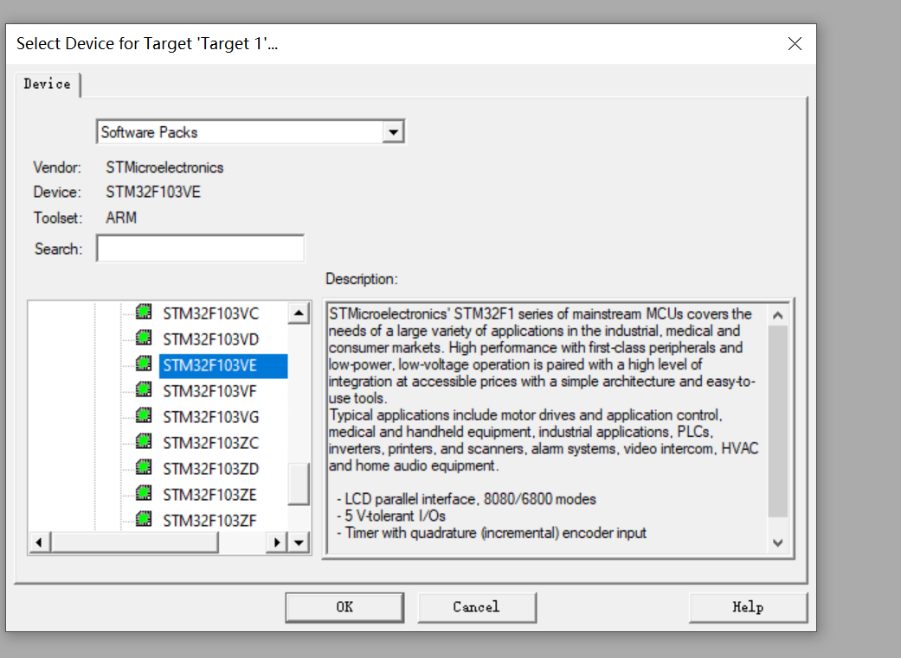
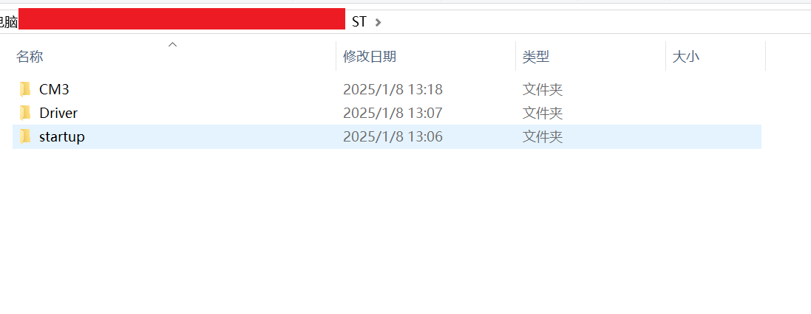
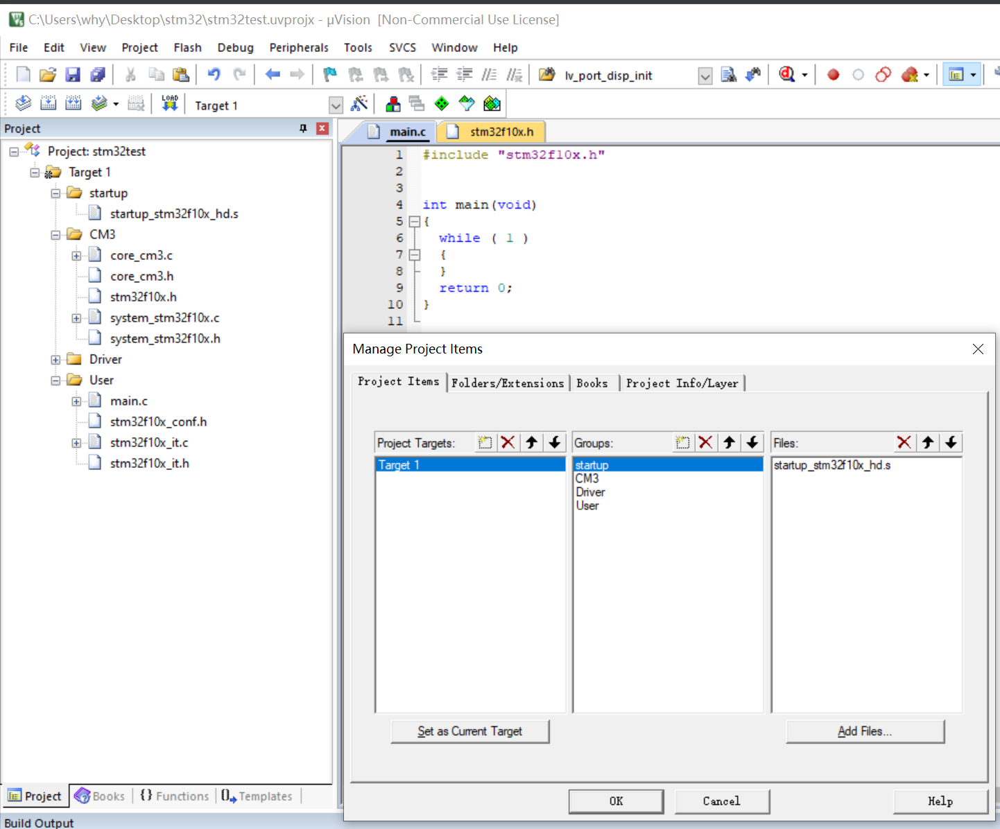
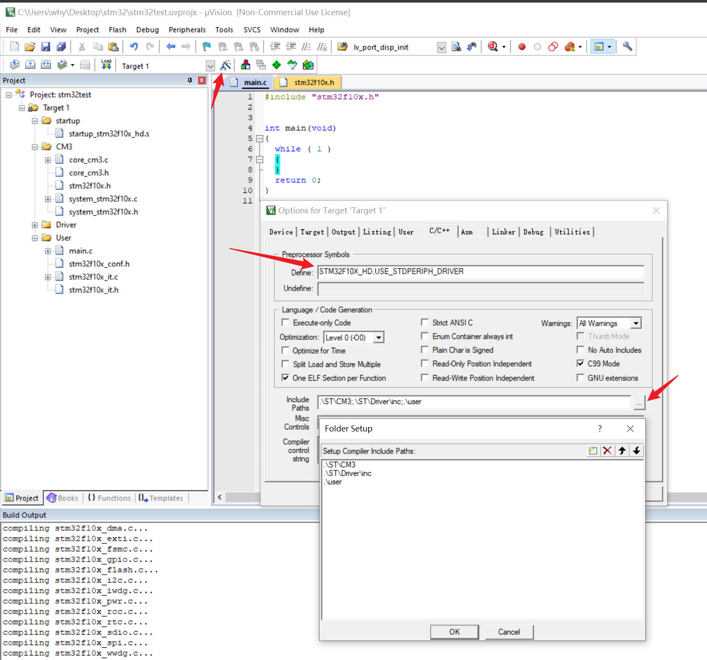

[指南者开发板-详细教程](https://doc.embedfire.com/mcu/stm32/f103zhinanzhe/std/zh/latest/book/KEIL5.html)
### 所有文件保存位置 ( 所有资源仅用于学习 )
https://www.alipan.com/s/s6vmyEJ5T33


### 安装Keil5
### 软件包

### 和谐

### 安装Keil.STM32F1xx_DFP.2.3.0.pack

### 创建第一个项目




### 固件库


[stm32   固件](https://www.st.com/en/embedded-software/stm32-standard-peripheral-libraries.html)


[stm32F10x 固件下载地址](https://www.st.com/zh/embedded-software/stsw-stm32054.html)
```text
stm32F10x 固件 github 个人备份
https://github.com/1663784811/1663784811.github.io/blob/main/docs/%E7%A1%AC%E4%BB%B6/STM32/en.stsw-stm32054_v3-6-0.zip
```


### ISP 下载程序


### 添加标准固件库








