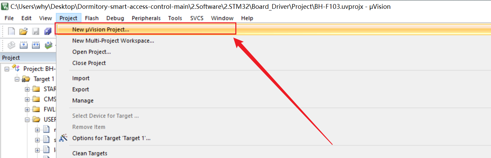
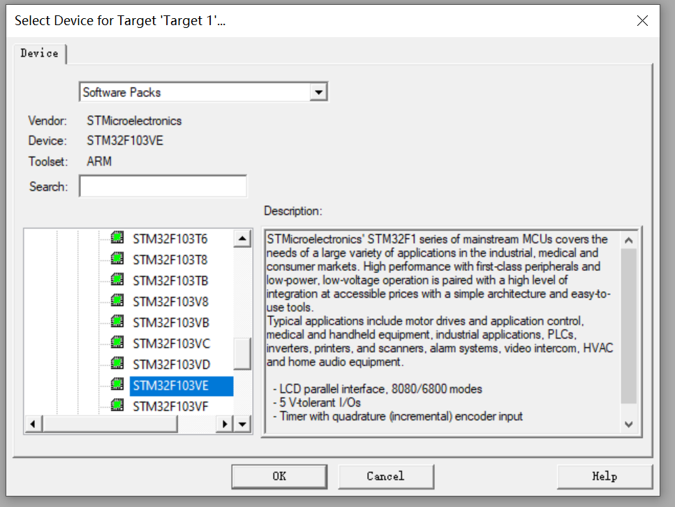
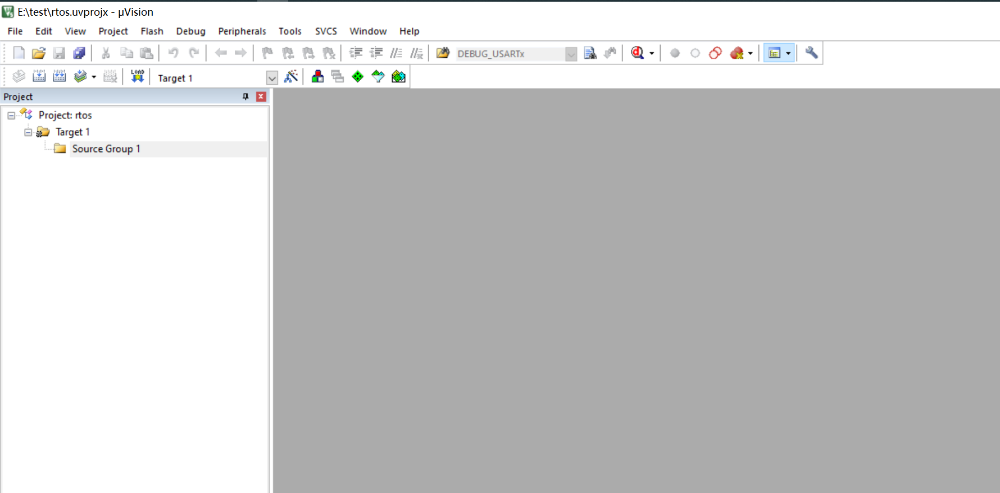

### freertos 下载地址
```text
https://github.com/FreeRTOS/FreeRTOS

https://www.freertos.org/zh-cn-cmn-s/a00104.html

```

### 目录结构 
```text

FreeRTOS
    Demo
    License
    Source          # 源码
    Test
FreeRTOS-Plus
    Demo
    Source
    Test
    ThirdParty
    VisualStudio_StaticProjects
tools
    aws_config_offline
    aws_config_quick_start
    cmock
```

### 新建工程










