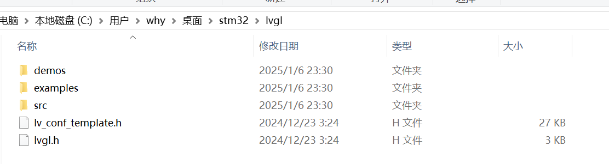
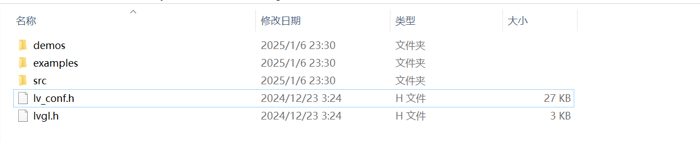
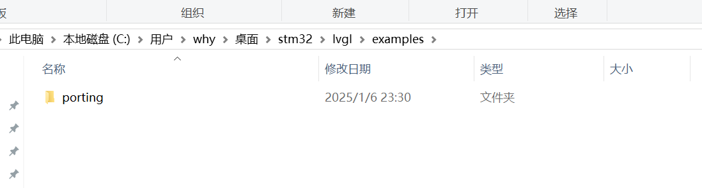
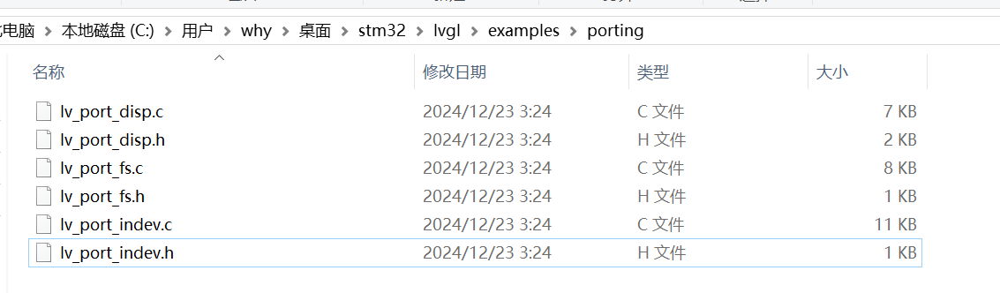

## 硬件要求
https://docs.lvgl.io/master/intro/introduction.html

```text
16, 32 or 64 bit microcontroller or processor

16 MHz clock speed is recommended

Flash/ROM: > 64 kB for the very essential components (> 180 kB is recommended)

RAM: > 48 kB

C99 or newer compiler
```

## 第一步: 下载LVGL 和 准备一个可用的stm32 工程
https://github.com/lvgl/lvgl/tree/release/v8.4

## 第二步： 把 LVGL 的src目录复制到工程 添加 文件到工程

lvgl 源码只保留 三个文件夹两个文件



把 lv_conf_template.h修改为 lv_conf.h



删除examples文件夹里不需要的文件, 只保留porting



修改porting文件夹里的文件名，把_template删除


把lvgl 文件夹复制到项目工程

## 第三步 修改配置


### 修改


