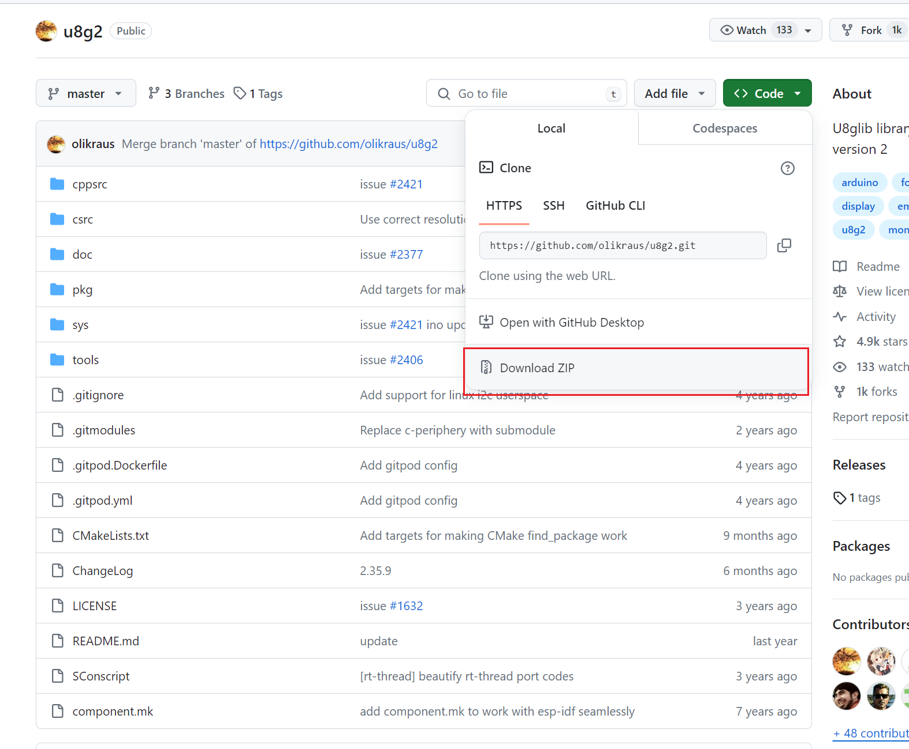
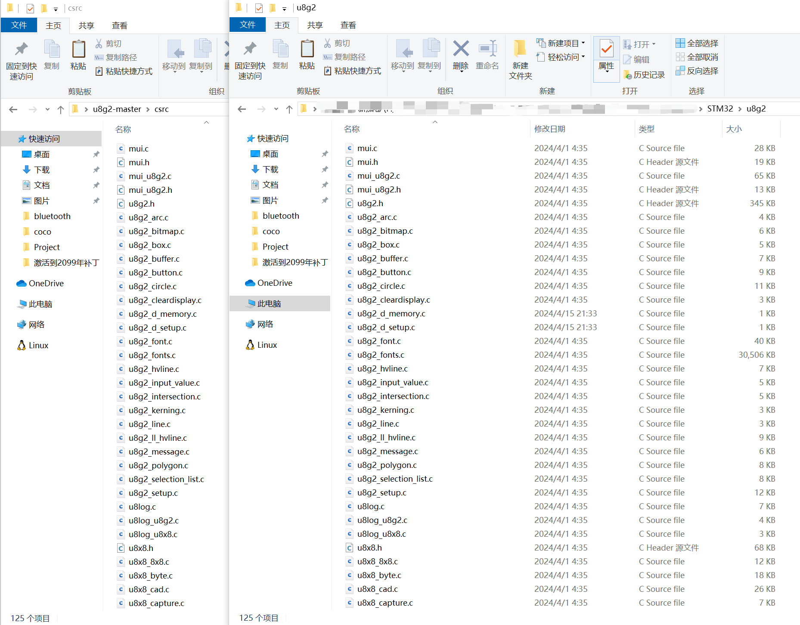
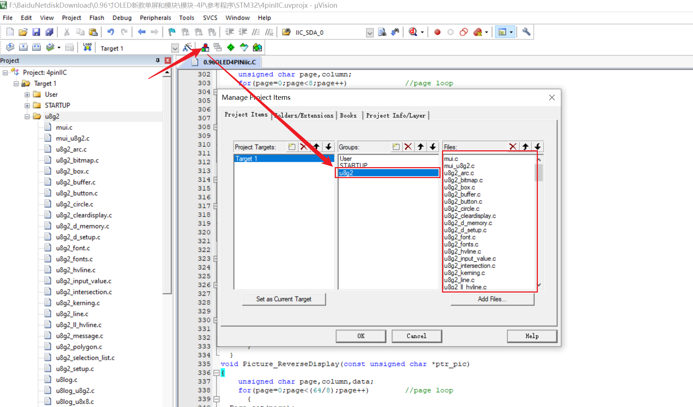
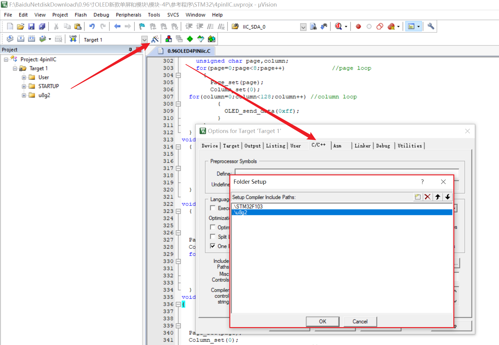
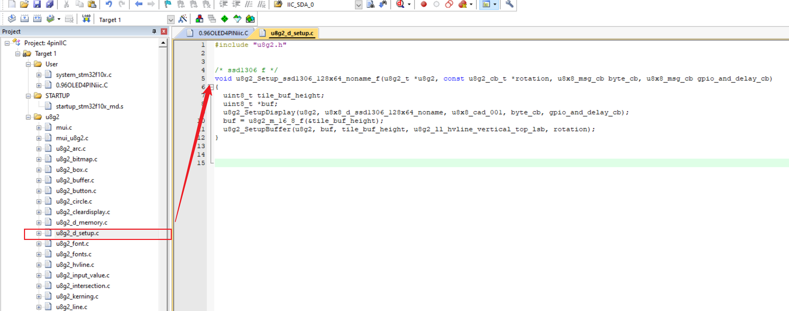
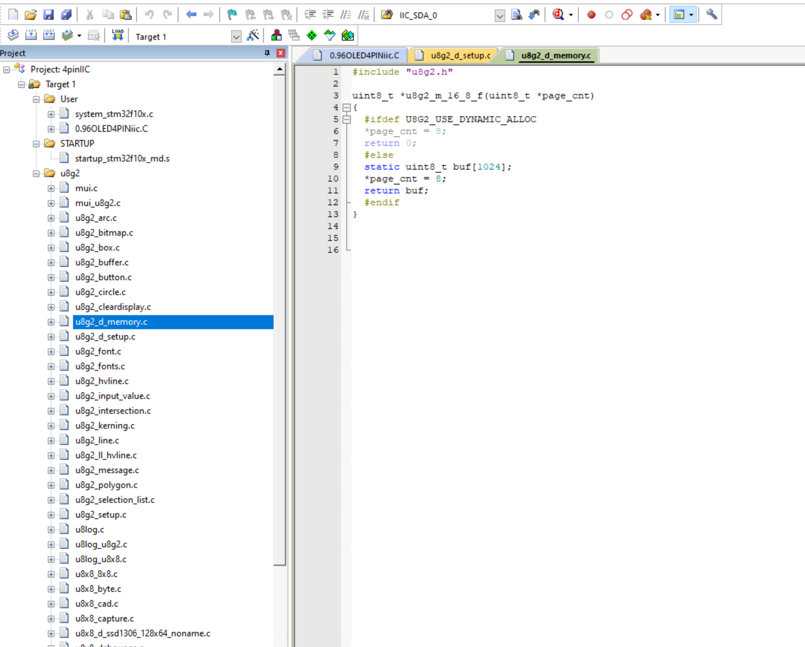

## 硬件
OLED 0.9寸屏   I2C 接口

stm32

## 搭建过程

### 第一步: 下载u8g2代码
[u8g2 github 地址](https://github.com/olikraus/u8g2)

### 第二步: 
将U8g2 目录下的 csrc 复制到 STM32项目下,并重命名为u8g2
删除u8x8_d_ 开头的所有文件( 除了u8x8_d_ssd1306_128x64_noname.c )

添加C文件和头文件到项目,

### 第三步:
精简U8g2_d_setup.c，只保留u8g2_Setup_ssd1306_i2c_128x64_noname_f函数（370行）

精简U8g2_d_memory.c，只保留u8g2_m_16_8_f（61行）

### 第四步: 编译

