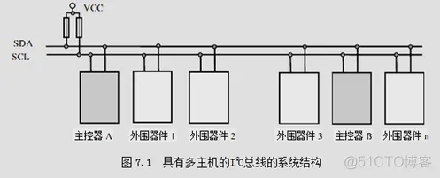
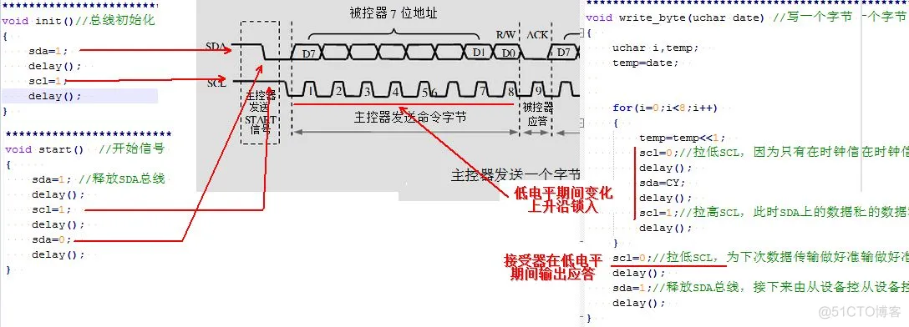

## I2C总线

双向二线制同步串行总线。它只需要两根线即可在连接于总线上的器件之间传送信息。

```text
SDA（串行数据线）
SCL（串行时钟线）
```




## 时序

### 1.空闲状态
I2C总线总线的SDA和SCL两条信号线同时处于**高电平时**，规定为总线的空闲状态。

此时各个器件的输出级场效应管均处在截止状态，即释放总线，

由两条信号线各自的上拉电阻把电平拉高。


### 2.起始位与停止位的定义：

起始信号： 当SCL为高期间，SDA由高到低的跳变；启动信号是一种电平跳变时序信号，而不是一个电平信号。

停止信号：当SCL为高期间，SDA由低到高的跳变；停止信号也是一种电平跳变时序信号，而不是一个电平信号。


## 电平变化




