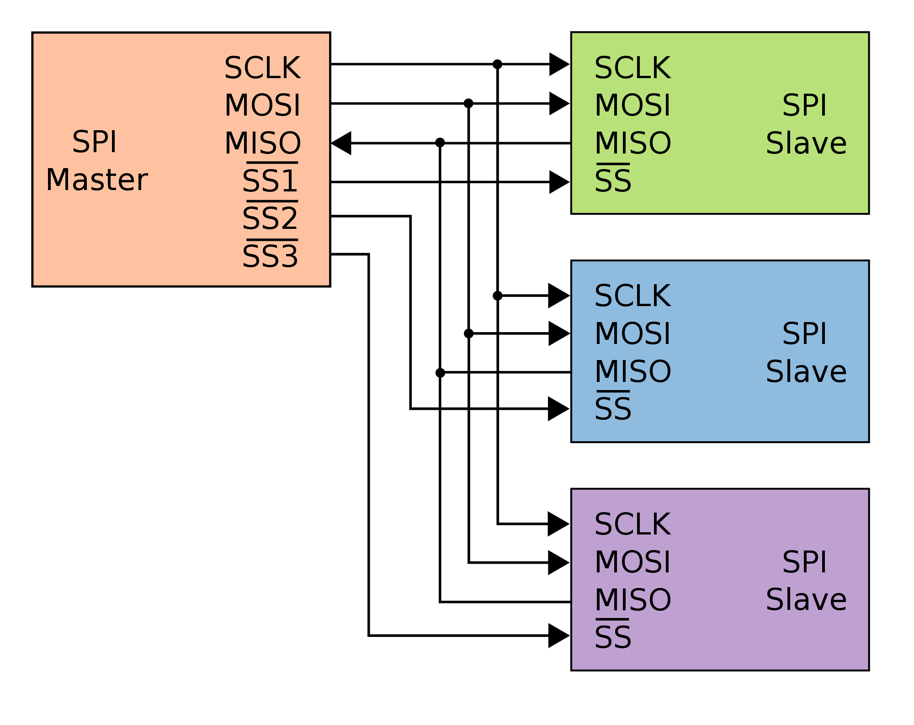

SPI，是一种高速的，全双工，同步的通信总线，并且在芯片的管脚上只占用四根线

[文档参考地址](https://doc.embedfire.com/mcu/stm32/f103/hal_general/zh/latest/doc/chapter24/chapter24.html#spi)

### SPI通信具有以下几个主要特点：
```text
1. 全双工（Full-Duplex）通信：主设备和从设备可以同时发送和接收数据，实现了同时的双向数据传输。
2. 同步传输：通信的主设备和从设备需要共享时钟信号，以确保数据的同步传输。
3. 串行通信：数据以位的形式通过单个引脚进行传输，逐位进行
4. 硬件控制：SPI通信不需要复杂的协议来控制通信，而是通过硬件信号进行控制。
```

SPI一共有四种通讯模式


## 物理层
### 引脚定义
```text
      主设备                    从设备
MOSI（数据输入）                  MOSI
MISO（数据输出）                  MISO
SCK（时钟）                      SCK
CS（片选）                       CS
```

### 接线原理图


## 协议层
### SPI基本通讯过程


### 通讯的起始和停止信号
SS信号线由高变低，是SPI通讯的起始信号。<br>
SS信号由低变高，是SPI通讯的停止信号。

### 数据有效性 ( 其中一种工作模式 )
1.保证两个SPI通讯设备之间使用同样的协定<br>
2.上图: SCK的下降沿时被采样。即在SCK的下降沿时刻，MOSI及MISO的数据有效，高电平时表示数据“1”，为低电平时表示数据“0”<br>
3.SPI每次数据传输可以8位或16位为单位，每次传输的单位数不受限制。

### 通讯过程
例: STM32作为SPI通讯的主机端时的数据收发过程。


