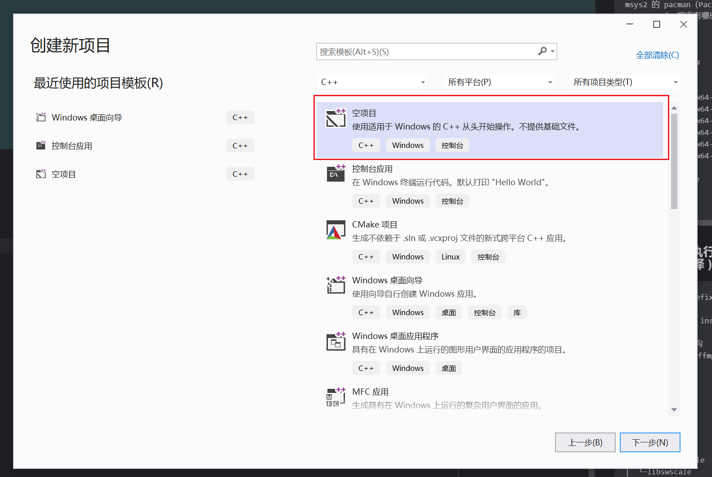
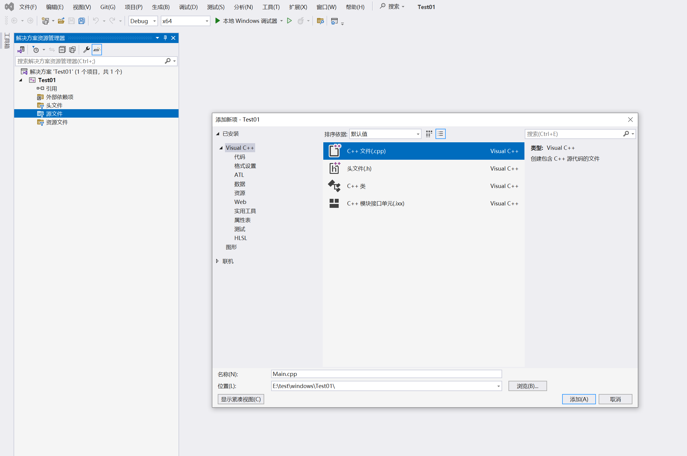
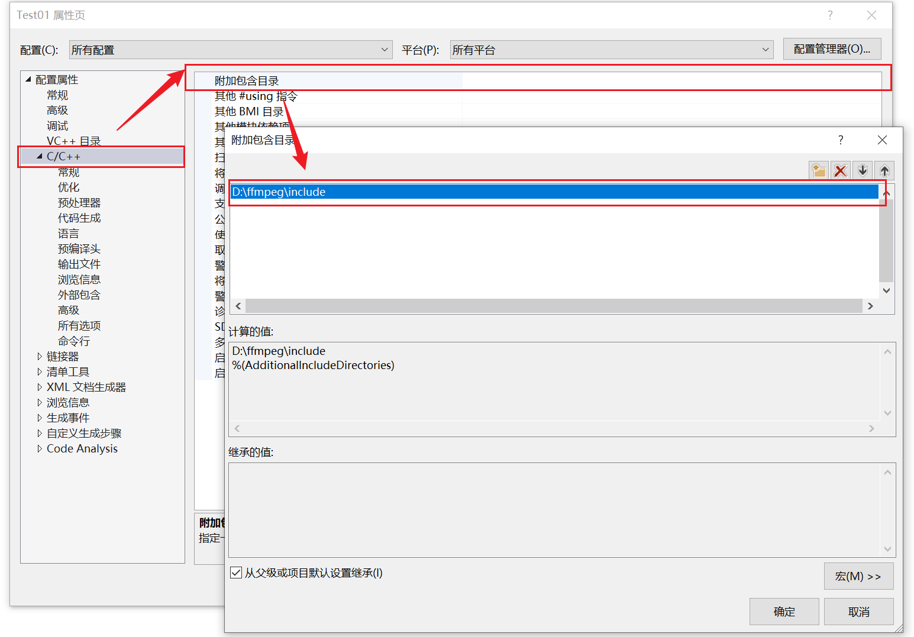
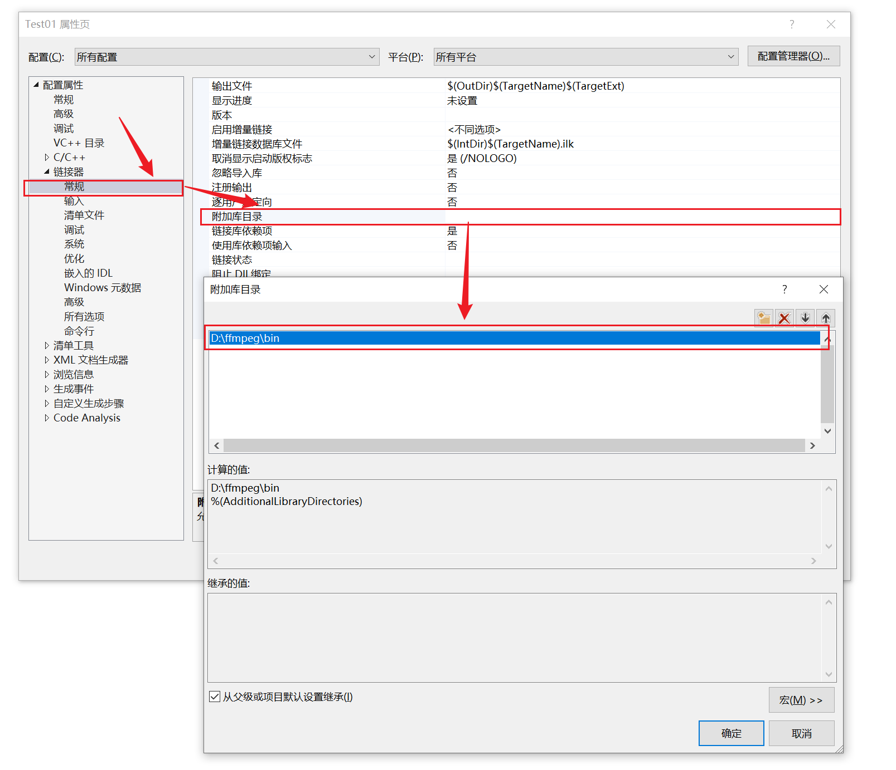
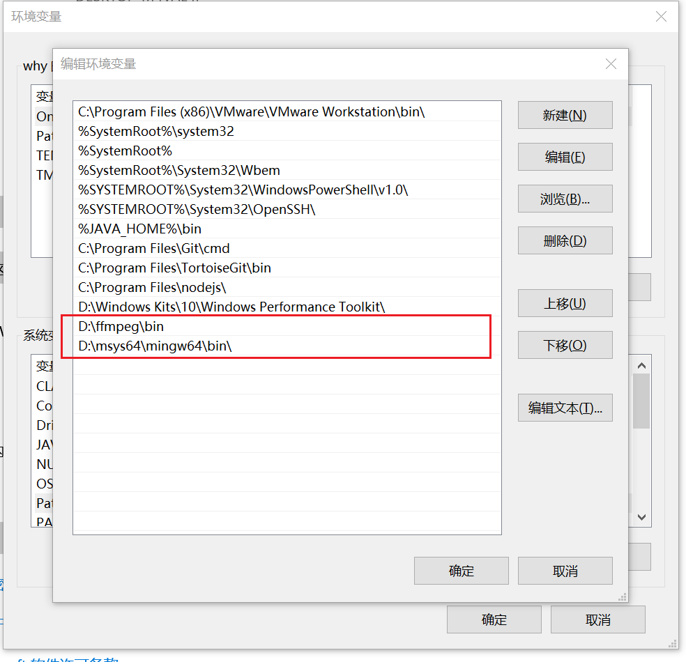

### 基础知识
```text
码率（Bit Rate）:是指单位时间内传输或处理的比特数量

视频分辨率:
    480p：通常指的是标准清晰度（Standard Definition，SD）视频，其水平分辨率为 854 像素 × 480 像素。
    720p：指的是高清晰度（High Definition，HD）视频，其水平分辨率为 1280 像素 × 720 像素。720p 视频通常拥有更清晰的图像质量和更高的画面分辨率。
    1080p：指的是全高清（Full High Definition，Full HD）视频，其水平分辨率为 1920 像素 × 1080 像素。1080p 视频拥有更高的分辨率和更清晰的图像质量，通常用于较高要求的视频内容。
    2K：通常指的是数码电影的分辨率标准之一，其水平分辨率约为 2048 像素。2K 分辨率在电影制作和数字电影放映中常见。
    4K：指的是超高清（Ultra High Definition，UHD）视频，其水平分辨率为 3840 像素 × 2160 像素。4K 分辨率是目前常见的高分辨率视频标准，提供比标准高清（1080p）四倍的像素数量，能够呈现更清晰、更详细的图像。
    8K：指的是超高清（Ultra High Definition，UHD）视频，其水平分辨率为 7680 像素 × 4320 像素。8K 分辨率是目前最高的主流视频标准之一，提供比 4K 四倍更多的像素数量，能够呈现出极其细致和清晰的图像，通常用于专业摄影、电影制作和高端显示设备。


视频帧: 是组成视频的基本单元,它代表了在某个时间点上的图像。
    视频帧由图像数据组成，它可以是静止的（I帧）、前后相似的（P帧）或者基于之前帧的差异（B帧）。
    视频帧以一定的帧率（通常以每秒帧数 FPS 表示）播放，帧率越高，视频看起来就越流畅。

音频帧: 是组成音频流的基本单元，它代表了在某个时间点上的音频数据,
       音频帧由一系列音频样本组成，每个样本表示在该时间点上的音频信号的振幅。
       音频帧的大小通常由采样率和位深度决定
       音频帧参数:
            采样率（Sample Rate）：采样率表示每秒对音频信号进行采样的次数，通常以赫兹（Hz）为单位。常见的采样率有 44100 Hz（CD音质）、48000 Hz（DVD、蓝光音质）、96000 Hz（高保真音频）等
            位深度（Bit Depth）：位深度表示每个采样点所用的比特数，它决定了音频信号的动态范围和精度。常见的位深度有 16 位（CD音质）、24 位（高保真音频）等
            声道数（Channels）：声道数表示音频流中的独立声道数量，常见的声道数有单声道（Mono）和立体声（Stereo），也可以是多声道（如5.1声道环绕声）
            

一个视频文件可能有多个视频流或音频流
一个音频流可以有多个声道


```
### 播放器推荐
```text
vlc

```

### 模块
libavcodec : 编/解码 <br/>
libavfilter : 帧级操作（如添加滤镜）<br/>
libavformat : 文件 I/O 和 封装/解封装 <br/>
libavdevice : 设备视频文件的封装/解封装 <br/>
libavutil : 通用工具集合<br/>
libswresample : 音频重采样、格式处理、混音等<br/>
libpostproc : 预处理<br/>
libswscale : 色彩处理和缩放<br/>

### 解码流程图


### 学习环境搭建

### windows ffmpeg编译


### 下载源码和软件

```text
# 下载ffmpeg源码
https://ffmpeg.org/download.html
# 下载msys2
https://www.msys2.org/

```

### msys2
```text
打开 MSYS2 MINGW64

msys2 的 pacman（Package Manager）是一个包管理工具。相当于centos的 yum
pacman -Sl：搜索有哪些包可以安装
pacman -S：安装
pacman -R：卸载

#################

# 编译工具链
pacman -S mingw-w64-x86_64-toolchain
pacman -S mingw-w64-x86_64-yasm
pacman -S mingw-w64-x86_64-SDL2
pacman -S mingw-w64-x86_64-fdk-aac
pacman -S mingw-w64-x86_64-x264
pacman -S mingw-w64-x86_64-x265

# 需要单独安装make
pacman -S make

```

### 编译windows执行程序 ( 要编译android需要的.so文件则请在linux下编译 )

```text
./configure --prefix=/usr/local/ffmpeg --enable-shared --disable-static --enable-gpl  --enable-nonfree --enable-libfdk-aac --enable-libx264 --enable-libx265

make -j8 && make install

## 编译后的目录结构
在目录/usr/local/ffmpeg下
├─bin
├─include
│  ├─libavcodec
│  ├─libavdevice
│  ├─libavfilter
│  ├─libavformat
│  ├─libavutil
│  ├─libpostproc
│  ├─libswresample
│  └─libswscale
├─lib
│  └─pkgconfig
└─share
    ├─ffmpeg
    │  └─examples
    └─man
        ├─man1
        └─man3
```

### 新建VS C++ 空项目


###  添加入口文件


```c
#include<stdio.h>
extern "C" {
#include <libavcodec\avcodec.h>

}
#pragma comment(lib, "avcodec.lib")


int main() {

	printf("%s\n", avcodec_configuration());
	return 0;
}

```
### 配置include目录


### 配置lib库目录


### 可能能会找不到DLL文件
在Path中添加dll目录


### 验证

```c
#include<stdio.h>
extern "C" {
#include <libavcodec\avcodec.h>
#include <libavformat\avformat.h>
}
#pragma comment(lib, "avcodec.lib")
#pragma comment(lib, "avformat.lib")

using namespace std;

int main() {


	AVFormatContext* ps = NULL;
	const char* path = "C:\\Users\\why\\Desktop\\temp\\PPlayer\\capture\\input.mp4";
	int ret = avformat_open_input(&ps, path,NULL, NULL);
	if (ret != 0) {
		printf("打开文件 ERROR： avformat_open_input");
		return -1;
	}
	ret = avformat_find_stream_info(ps, NULL);
	if (ret) {
		printf("获取解码信息 ：avformat_find_stream_info");
		return -1;
	}
	int time = ps->duration;
	int mbitTime = (time / 1000000) /60;
	int mminTime = (time / 1000000) %60;

	printf("时间%d分%d秒", mbitTime, mminTime);

	// 获取流信息
	int VideoStream = -1;
	int AudioStream = -1;
	// av_find_best_stream(ps,);

	return 0;
}

```


