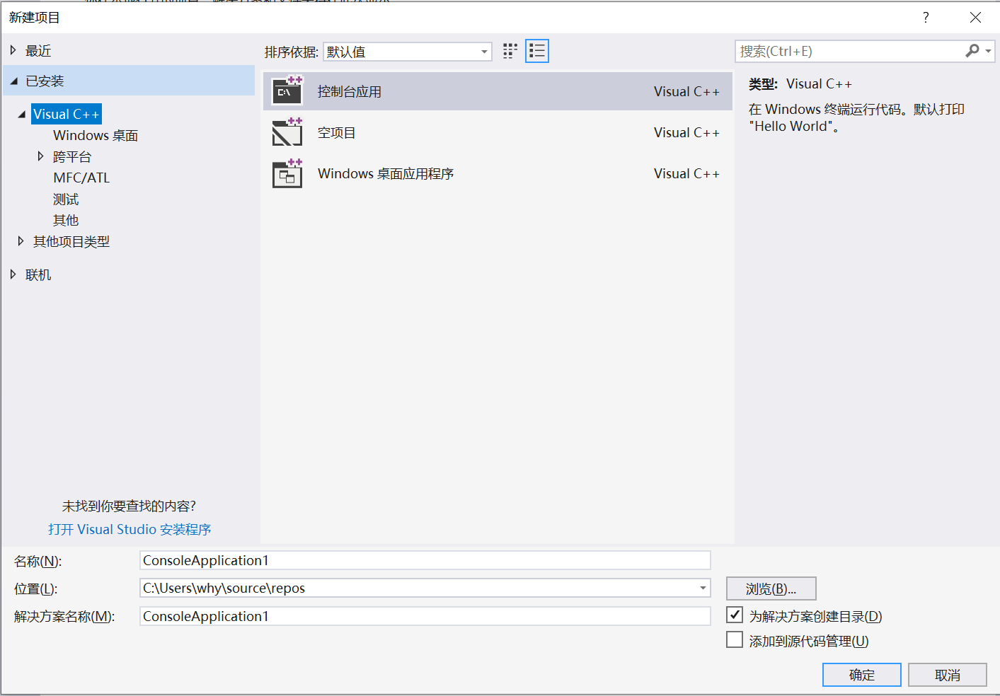
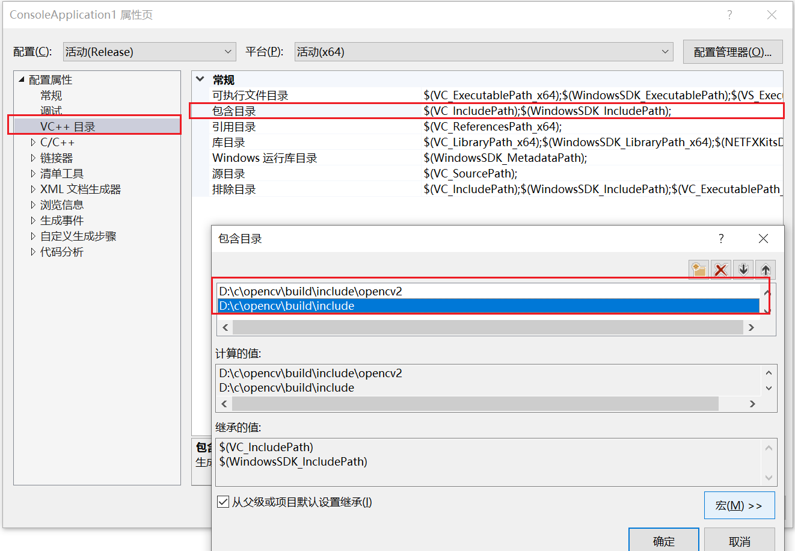
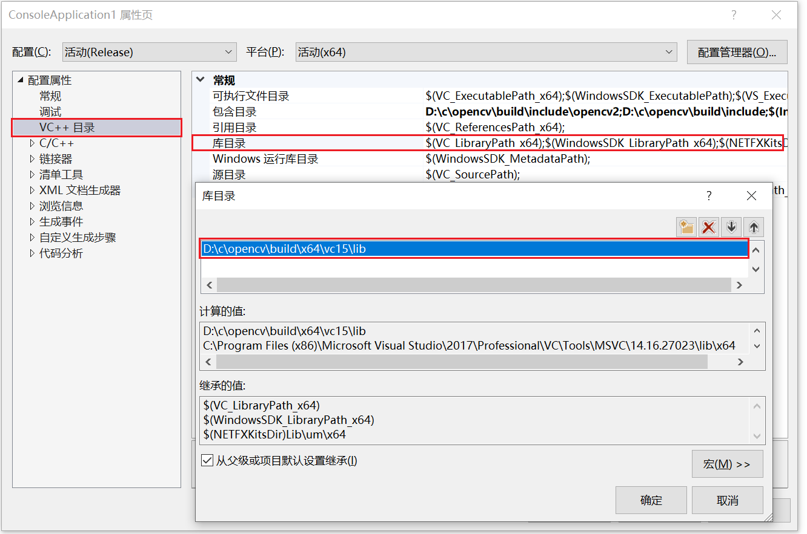
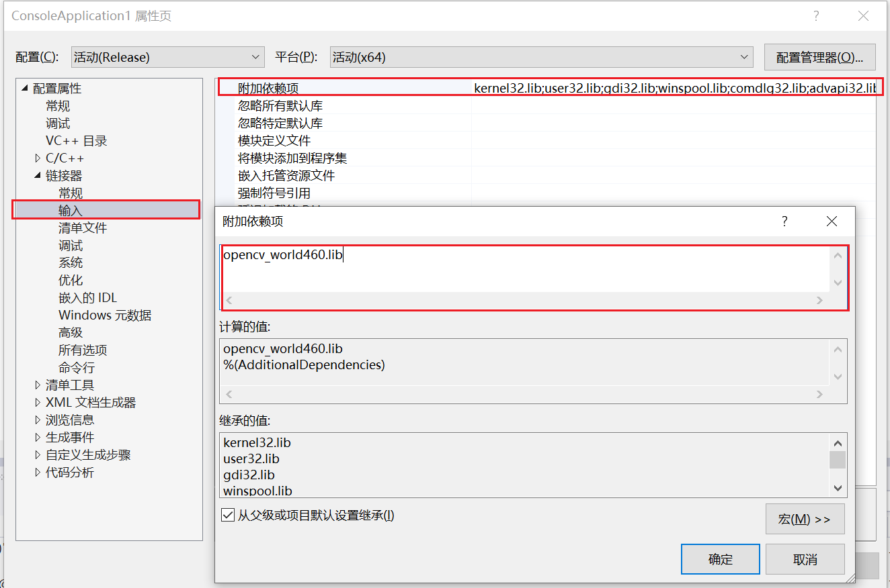

文档:
https://blog.csdn.net/djstavaV/article/details/125383444


```text
环境
    widnows 10
    clion 2022.1.1
    mingw 8.1.0
    opencv 4.5.5


MinGW
    https://sourceforge.net/projects/mingw-w64/files/Toolchains targetting Win64/
    
    解压，然后将其中的 bin 目录加入到系统环境变量中
    新开一个命令行，输入命令 gcc -v 来验证一下

cmake
    同样也是来到官网，https://cmake.org/download/，
    将其也加入到系统环境变量中
    
opencv
    来到官网 https://opencv.org/releases/，下载 windows 对应的版本，现在最新的版本是 4.5.5


```

---
## 第二种方法


教程：
https://docs.opencv.org/4.x/d3/d52/tutorial_windows_install.html

1. 下载安装包:

   https://sourceforge.net/projects/opencvlibrary/files/4.6.0/

   解压到 D:/c

    1. 配置环境变量

   OPENCV_DIR    D:\c\opencv\build\x64\vc15

   path          %OPENCV_DIR%\bin


2. 新建项目

   

3. 设置包含目录

   

4. 设置库目录

   

5. 配置连接器
   

6. 修配
   

7.编写代码
```c++

#include <opencv2/opencv.hpp>
#include <iostream>

using namespace cv;
using namespace std;

int main(int argc, char* argv[])
{
	Mat src = imread("D:/a.jpg");
	imshow("input", src);
	waitKey(0);
	destroyAllWindows();
	return 0;
}

```


