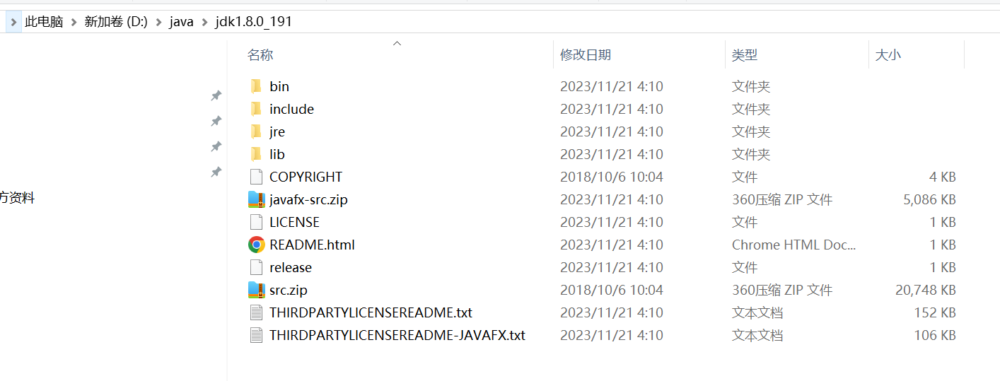
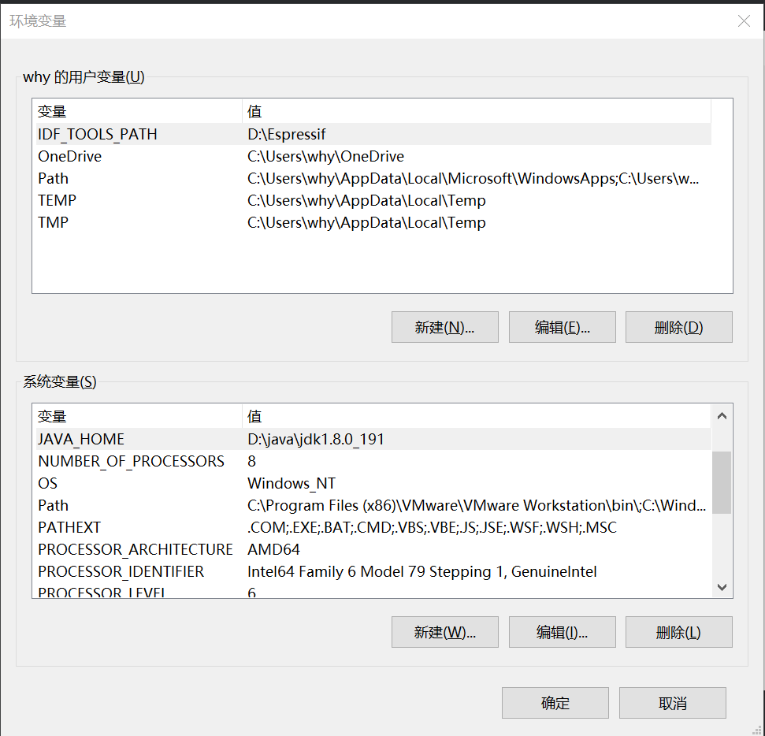
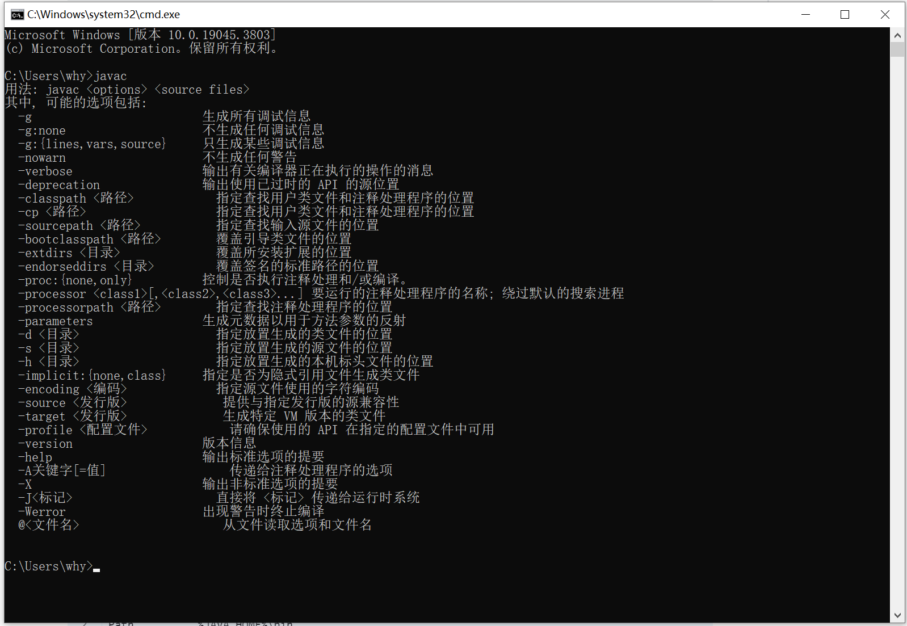

## 下载JDK
```text
下载地址
https://www.oracle.com/java/technologies/javase/javase8u211-later-archive-downloads.html
```


## 安装JDK
```text
安装位置
D:\java\jdk1.8.0_191

```


## 配置path & classpath

```text
JAVA_HOME     D:\java\jdk1.8.0_191
Path          %JAVA_HOME%\bin
CLASSPATH     .;%JAVA_HOME%\lib\dt.jar;%JAVA_HOME%\lib\toos.jar
```



## 测试
```text
java
javac
java -version
```



