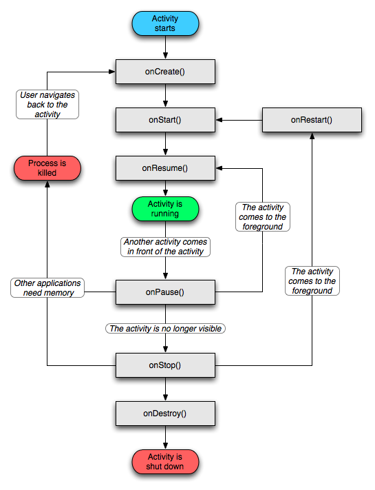

### 生命周期





### 传参
```java
import androidx.activity.result.ActivityResultLauncher;
import androidx.activity.result.contract.ActivityResultContracts;
import androidx.annotation.Nullable;
import androidx.appcompat.app.AppCompatActivity;

import android.app.Activity;
import android.content.Intent;
import android.os.Bundle;
import android.util.Log;
import android.view.View;
import android.widget.Toast;

public class MainTestActivity extends AppCompatActivity {
    public static final String testKey = "ssssssss";
    private ActivityResultLauncher<Intent> activityResultLauncher;
    @Override
    protected void onCreate(Bundle savedInstanceState) {
        super.onCreate(savedInstanceState);
        setContentView(R.layout.activity_main_test);

        activityResultLauncher = registerForActivityResult(new ActivityResultContracts.StartActivityForResult(), result -> {
            if (result.getResultCode() == Activity.RESULT_OK && result.getData() != null) {
                String returnedResult = result.getData().getStringExtra(testKey);
                Toast.makeText(this, "Result: " + returnedResult, Toast.LENGTH_LONG).show();
            }
        });

        View test_01 = findViewById(R.id.test_01);
        test_01.setOnClickListener((View v) -> {
            Intent intent = new Intent(MainTestActivity.this, Test2Activity.class);
            intent.putExtra(testKey, "名称");

            Bundle bundle = new Bundle();
            bundle.putString("name", "qll");
            bundle.putInt("age", 3);
            intent.putExtras(bundle);

            activityResultLauncher.launch(intent);
        });
    }
}
```

### Test2Activity
```java
import androidx.appcompat.app.AppCompatActivity;

import android.content.Intent;
import android.os.Bundle;
import android.util.Log;
import android.view.View;

public class Test2Activity extends AppCompatActivity {
    private static final String TAG = "Test2Activity ";
    @Override
    protected void onCreate(Bundle savedInstanceState) {
        super.onCreate(savedInstanceState);
        setContentView(R.layout.activity_test2);

        Intent intent = getIntent();
        Bundle date = intent.getExtras();
        Log.i(TAG, "数据:: " + date.getString(MainTestActivity.testKey));
        Bundle extras = intent.getExtras();
        Log.i(TAG, "数据2:: " + extras.getString("name"));
        View test_02 = findViewById(R.id.test_02);

        test_02.setOnClickListener((View v) -> {
            Intent i = new Intent();
            i.putExtra(MainTestActivity.testKey, "cccc");
            setResult(RESULT_OK, i);
            finish();
        });

    }
}
```

