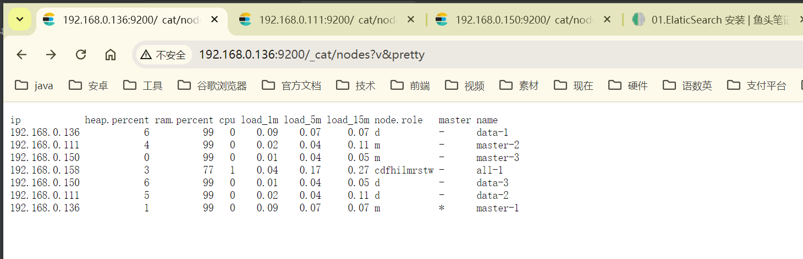

#### 注意
节点启动过单节点一定要把data目录和logs目录删除

```text
节点
Data nodes — 存储数据并执行与数据相关的操作，例如搜索和聚合     (  必需要  )
Master nodes — 负责集群范围的管理和配置操作，例如添加和删除节点   (  必需要  )

Client nodes — 将集群请求转发给主节点，将数据相关的请求转发给数据节点   (  非需要, 推荐  )
Ingest nodes — 用于在索引之前预处理文档                              (  非需要  )


3个 Master         ( node1:9200,   node2:9200,  node3:9200 )
3个 Data           ( node4:9200,   node5:9200,  node6:9200 )


3个 Client         ( node1:19200,   node2:19200,  node3:19200 )
1个 Ingest         ( node1:8200)


副本: 不需要单独指定副本节点,自动分配
     配置副本分片数量:
        可以通过索引的设置来配置每个索引的副本分片数量。这可以在索引创建时设置，也可以在索引创建后通过更新设置来调整
```

## ElaticSearch集群安装

### 修改电脑配置

/etc/security/limits.conf  追加以下内容
```shell
* soft nofile 655360
* hard nofile 655360
```

/etc/sysctl.conf
```shell
vm.max_map_count=262144
```
```shell
sudo sysctl -p
```


### 修改/etc/hosts
```text
192.168.0.136 master-1
192.168.0.111 master-2
192.168.0.150 master-3
```


### 第一步: 下载ElaticSearch

[官网下载地址](https://www.elastic.co/cn/downloads/elasticsearch)

### 第二步: Master配置

```yaml
cluster.name: my-application
node.name: master-1
path.data: ./data
path.logs: ./logs
network.host: 0.0.0.0
http.port: 9200
discovery.seed_hosts: ["192.168.0.136:9300", "192.168.0.111:9300", "192.168.0.150:9300"]
cluster.initial_master_nodes: ["master-1","master-2","master-3"]

# Enable security features
xpack.security.enabled: false
xpack.security.enrollment.enabled: false
# Enable encryption for HTTP API client connections, such as Kibana, Logstash, and Agents
xpack.security.http.ssl:
  enabled: false
  keystore.path: certs/http.p12
# Enable encryption and mutual authentication between cluster nodes
xpack.security.transport.ssl:
  enabled: true
  verification_mode: certificate
  keystore.path: certs/transport.p12
  truststore.path: certs/transport.p12

http.host: 0.0.0.0
transport.host: 192.168.0.136
transport.port: 9300
node.roles: [master]
```

### 第三步: Data配置

```yaml
cluster.name: my-application
node.name: data-1
path.data: ./data
path.logs: ./logs
network.host: 0.0.0.0
http.port: 8200
discovery.seed_hosts: ["192.168.0.136:8300", "192.168.0.136:9300", "192.168.0.111:9300", "192.168.0.150:9300"]

# Enable security features
xpack.security.enabled: false
xpack.security.enrollment.enabled: false
# Enable encryption for HTTP API client connections, such as Kibana, Logstash, and Agents
xpack.security.http.ssl:
  enabled: false
  keystore.path: certs/http.p12
# Enable encryption and mutual authentication between cluster nodes
xpack.security.transport.ssl:
  enabled: true
  verification_mode: certificate
  keystore.path: certs/transport.p12
  truststore.path: certs/transport.p12

http.host: 0.0.0.0
transport.host: 192.168.0.136
transport.port: 8300
node.roles: [data]

```

### 第四步: Client配置

```text

```

### 第六步: 启动集群

```shell
nohup ./elasticsearch &
```

