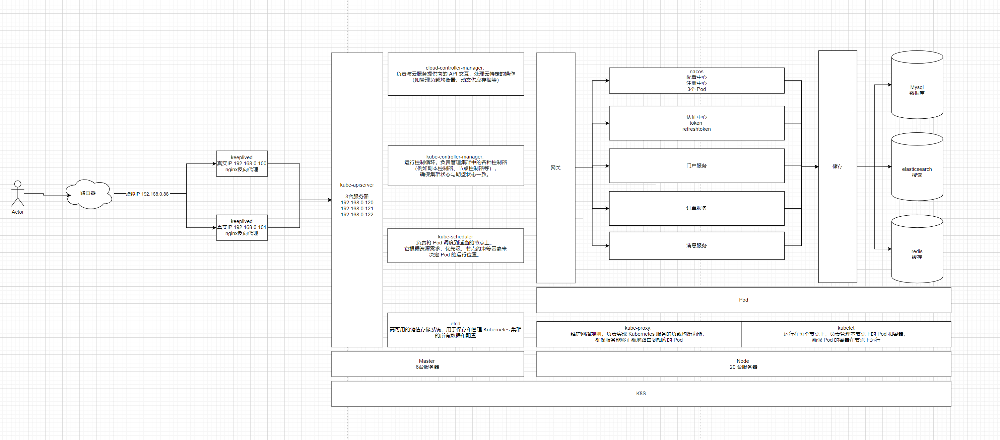

[kubernetes 官网](https://kubernetes.io/zh-cn/docs/home/)

[kubesphere 官网](https://kubesphere.io/zh/)

## 服务架构图




### k8s 组件
#### Master 组件

```text

kube-apiserver: 提供了 Kubernetes API 接口，是集群的主要控制中心，处理所有的 REST 操作，维护集群的状态和配置。

etcd: 高可用的键值存储系统，用于保存和管理 Kubernetes 集群的所有数据和配置。

kube-scheduler: 负责将 Pod 调度到适当的节点上。它根据资源需求、优先级、节点约束等因素来决定 Pod 的运行位置。

kube-controller-manager: 运行控制循环，负责管理集群中的各种控制器（例如副本控制器、节点控制器等），确保集群状态与期望状态一致。

cloud-controller-manager: 负责与云服务提供商的 API 交互，处理云特定的操作（如管理负载均衡器、动态供应存储等）。

```


#### Node 组件
```text

kubelet: 运行在每个节点上，负责管理本节点上的 Pod 和容器，确保 Pod 的容器在节点上运行。


kube-proxy: 维护网络规则，负责实现 Kubernetes 服务的负载均衡功能，确保服务能够正确地路由到相应的 Pod。

容器运行时（Container Runtime）: 实际执行容器的环境，例如 Docker、containerd 或 CRI-O。

```


