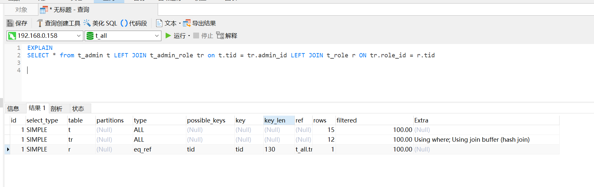

### 使用合适的索引
索引设计：根据查询模式和数据访问模式来设计索引。确保频繁查询的列上建立索引，避免在大表上使用全表扫描

联合索引：考虑使用联合索引来覆盖多个查询条件，减少索引的维护成本和查询时间。

避免过多索引：过多的索引会增加数据修改的成本（如插入、更新、删除），应避免不必要的索引。

### 优化查询语句
选择性：确保 WHERE 子句中的条件具有良好的选择性，以利用索引的效果。

避免使用通配符查询：避免在 LIKE 操作中使用通配符（如 %value%），尽可能使用前缀搜索或全文索引。

使用 EXISTS 或 IN 替代多个 OR 条件：将多个 OR 条件替换为 EXISTS 或者 IN 子查询，可以提高查询效率。

优化 JOIN 操作：使用 INNER JOIN、LEFT JOIN 等关联方式，并确保关联字段有索引。

避免子查询：尽可能使用 JOIN 操作替代子查询，因为子查询可能会导致数据库多次扫描数据。

### 数据库结构优化
规范化：适当的数据库规范化可以减少数据冗余，提高数据一致性和查询效率。

反规范化：在需要频繁查询的字段上进行反规范化，避免 JOIN 操作过多。


### 查询缓存和缓存策略
使用查询缓存：MySQL 提供了查询缓存机制，但在某些情况下会影响性能，需要根据具体情况进行配置。

应用层缓存：在应用程序层面实现数据缓存，如 Memcached 或 Redis，减少数据库的访问压力。

### 监控和调整
使用性能监控工具：定期监控数据库性能指标，如查询响应时间、慢查询日志、索引使用情况等。

分析执行计划：使用 EXPLAIN 命令分析查询执行计划，了解查询的优化潜力和瓶颈所在。


## EXPLAIN 关键字




### id: 
查询的唯一标识符，显示执行计划中每个操作的顺序编号。值越小的操作优先级越高。

### select_type: 
```text
表示查询的类型，如 
SIMPLE（简单查询）、
PRIMARY（主查询）、
UNION（联合查询）、
SUBQUERY（子查询）等。
```
### table: 
```text
显示查询中涉及的表名。
```

### type: 
显示 MySQL 选择行的方式。常见的类型有：
```text
ALL：全表扫描，效率最低。
index：索引扫描，但不使用索引的全部列。
range：索引范围扫描。
ref：基于索引进行扫描，用于非唯一索引。
eq_ref：每个索引值都被唯一引用，通常与主键或唯一索引一起使用。
const、system：常量访问或系统表，通常效率很高。
possible_keys: 显示可能用于查询的索引列表。
```

### key: 
```text
实际使用的索引。
```

### key_len: 
```text
使用的索引的长度。显示了索引列的长度。
```

### ref: 
```text
显示索引的哪个列被用于查找。
```

### rows: 
```text
估算扫描的行数。表示从表中读取的行的数量的估计值。
```

### Extra: 
```text
显示额外的信息， 如 
    Using where（使用 WHERE 子句过滤）、
    Using index（仅使用索引）、
    Using temporary（使用临时表）等。
```


