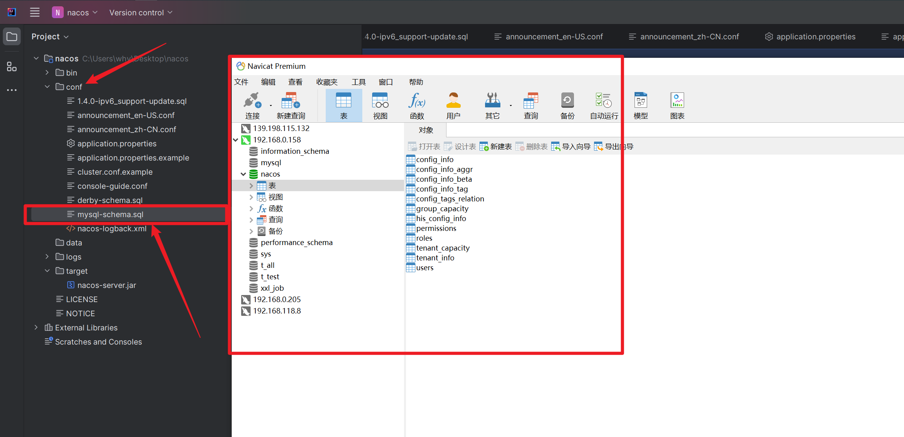
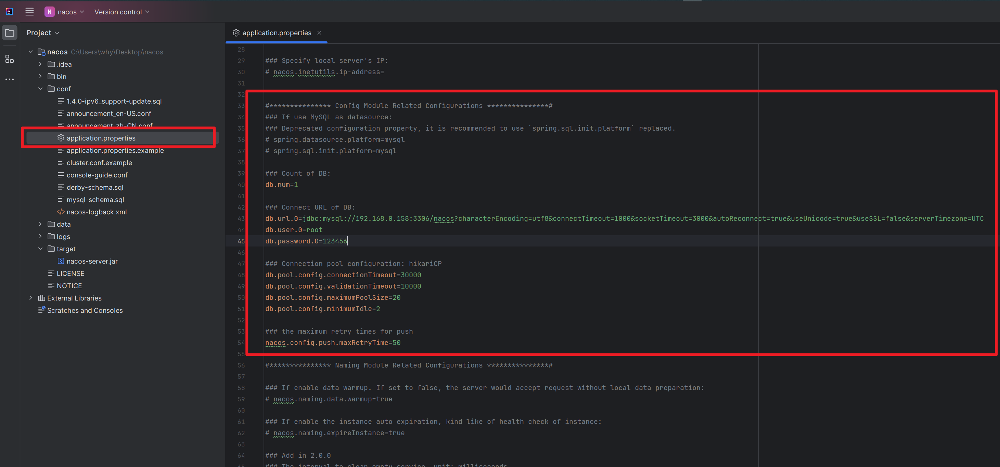

### 动态命名和配置服务


[官网下载地址](https://nacos.io/download/nacos-server/)

[gitHub下载地址](https://github.com/alibaba/nacos)


[官方文档](https://nacos.io/docs/latest/quickstart/quick-start/)
[官方文档](https://nacos.io/zh-cn/docs/v2/guide/user/auth.html)


### 第一步: 导入sql到数据库




### 第二步：修改配置
```shell
#*************** Config Module Related Configurations ***************#
### If use MySQL as datasource:
### Deprecated configuration property, it is recommended to use `spring.sql.init.platform` replaced.
spring.datasource.platform=mysql
spring.sql.init.platform=mysql

### Count of DB:
db.num=1

### Connect URL of DB:
db.url.0=jdbc:mysql://192.168.0.158:3306/nacos?characterEncoding=utf8&connectTimeout=1000&socketTimeout=3000&autoReconnect=true&useUnicode=true&useSSL=false&serverTimezone=UTC
db.user.0=root
db.password.0=123456

### Connection pool configuration: hikariCP
db.pool.config.connectionTimeout=30000
db.pool.config.validationTimeout=10000
db.pool.config.maximumPoolSize=20
db.pool.config.minimumIdle=2


```



### 启动
单机启动  `startup.cmd -m standalone`


### 访问
http://127.0.0.1:8848/nacos/index.html


### 开启鉴权

```shell

### The auth system to use, currently only 'nacos' and 'ldap' is supported:
nacos.core.auth.system.type=nacos

### If turn on auth system:   是否开启鉴权功能
nacos.core.auth.enabled=true

### Turn on/off caching of auth information. By turning on this switch, the update of auth information would have a 15 seconds delay.
nacos.core.auth.caching.enabled=true

### Since 1.4.1, Turn on/off white auth for user-agent: nacos-server, only for upgrade from old version.
nacos.core.auth.enable.userAgentAuthWhite=false

### Since 1.4.1, worked when nacos.core.auth.enabled=true and nacos.core.auth.enable.userAgentAuthWhite=false.
### The two properties is the white list for auth and used by identity the request from other server.
nacos.core.auth.server.identity.key=nacos
nacos.core.auth.server.identity.value=nacos

### worked when nacos.core.auth.system.type=nacos
### The token expiration in seconds:
nacos.core.auth.plugin.nacos.token.cache.enable=false
nacos.core.auth.plugin.nacos.token.expire.seconds=18000
### The default token (Base64 String):
nacos.core.auth.plugin.nacos.token.secret.key=SecretKey012345678901234567890123456789012345678901234567890123456789


```
