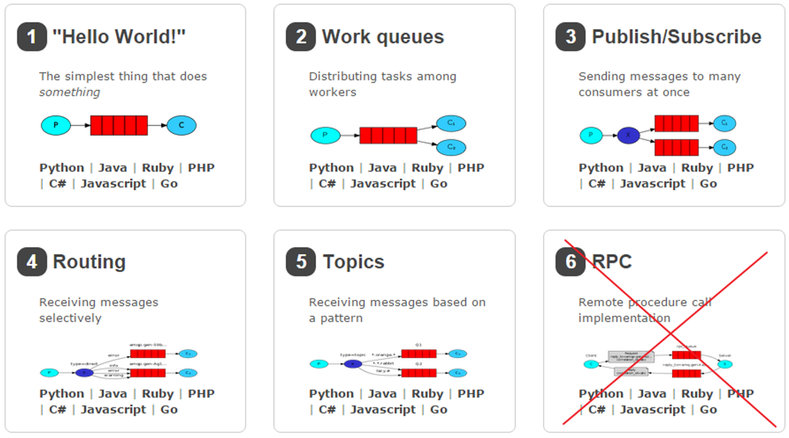

### 简单工作模型:
```text
一个生产者，一个队列 ，一个消费者（一对一）
```

### 工作模型:
```text
一个生产者 ==> 一个队列 ==> 多个消费者。
一个消息只能被消费一次。
```

### 订阅模式-----Fanout（广播）:
```text
一个生产者 ==> 一个交换机 ==> 多个列队 ==> 多个消费者。
一个消息可以被多个消费者消费生产者发生消息只能发送到交换机。
```

### 订阅模式 ---- Direct（路由）
```text
一个生产者 ==> 一个交换机 ==> 多个队列 ==> 多个消费者routing Key ，
一个消息发送给符合 routing Key 的队列
```

### 订阅模式 ---- topic（通配符）
```text
Topic类型的Exchange与Direct相比，都是可以根据RoutingKey把消息路由到不同的队列。
只不过Topic类型Exchange可以让队列在绑定Routing key 的时候使用通配符！
```




